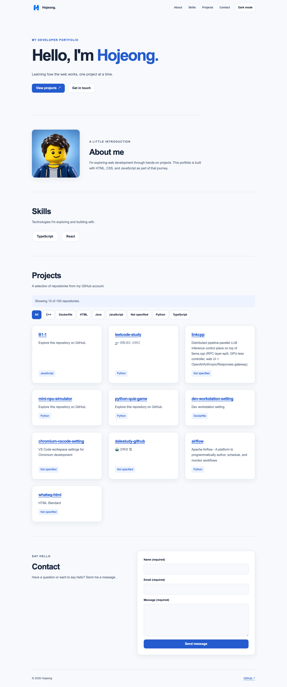
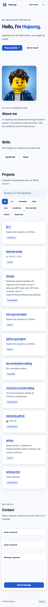
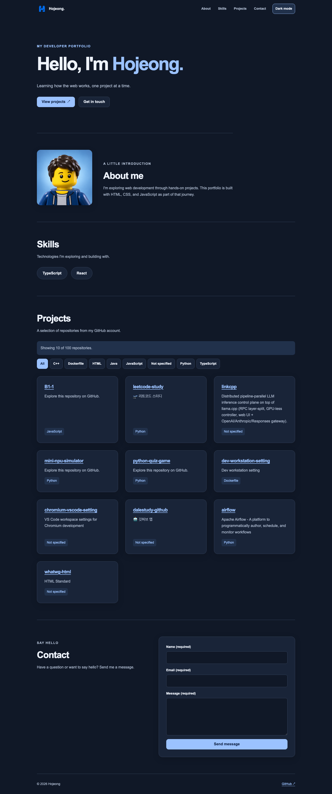

# B1-1 — Hojeong Portfolio

순수 HTML, CSS, JavaScript로 만든 반응형 포트폴리오입니다. 자기소개, 기술 목록, GitHub 저장소 목록과 문의 폼을 제공합니다.

- [배포 사이트](https://parkhojeong.github.io/B1-1/)
- [GitHub 저장소](https://github.com/parkhojeong/B1-1)
- 사용 기술: HTML5, CSS Grid/Flexbox, JavaScript, Fetch API, Intersection Observer, localStorage
- 실행: VS Code Live Server로 `index.html`을 열거나, 프로젝트 폴더에서 `python3 -m http.server 8000` 실행 후 `http://localhost:8000` 접속

## 구현 체크리스트

- [x] 모바일·태블릿·데스크톱 반응형 레이아웃과 다크 모드
- [x] 모바일 메뉴 열기·닫기, Escape 및 바깥 영역 클릭 처리
- [x] 스크롤 60px 이상에서 헤더 배경과 그림자 변경
- [x] 스크롤 300px 이상에서 맨 위로 이동 버튼 표시
- [x] 부드러운 앵커 이동과 스크롤 애니메이션
- [x] GitHub API 연동, 로딩·빈 목록·실패·재시도 표시
- [x] `array.filter()`를 활용한 언어별 필터 버튼
- [x] Hero 소개 문장의 타이핑 효과
- [x] 시스템 테마 감지와 사용자가 선택한 테마 저장
- [x] 폼 검증과 입력 중 에러 갱신
- [x] EmailJS 연결 코드·공개 설정 및 전송 대기·성공·실패 처리
- [x] EmailJS 템플릿 변수 및 실제 이메일 수신 확인
- [x] 데스크톱·모바일·다크 모드 스크린샷


## 파일별 역할

```text
css/
├─ base.css          공통 변수, 테마, 기본 스타일
├─ layout.css        헤더·본문 배치, 프로젝트 Grid, 반응형 레이아웃
└─ components.css    버튼, 메뉴, 카드, 폼, 애니메이션

js/
├─ api.js            GitHub 저장소 요청과 HTTP·네트워크 에러 처리
├─ projects.js       ProjectsState: 상태 관리, ProjectsSection: 요청·필터·렌더링
├─ email.js          EmailJS 공개 설정과 이메일 전송 요청
├─ form.js           FormState: 상태 관리, ContactForm: 이벤트·검증·전송·렌더링
├─ theme.js          ThemeToggle: 시스템 테마·사용자 선택·저장·렌더링
├─ navigation.js     Navigation: 메뉴·스크롤 처리, 섹션 등장 애니메이션
└─ hero.js           HeroTyping: 타이핑 진행 상태와 렌더링

images/screenshots/  제출용 화면 캡처
```

CSS는 `base → layout → components` 순서로 연결합니다. 각 요소의 미디어 쿼리는 해당 요소와 같은 파일에 둡니다.
JS는 모두 `defer`로 연결하며, `getRepositories()`를 제공하는 `api.js`가 `projects.js`보다 먼저 실행됩니다.
`sendContactEmail()`을 제공하는 `email.js`는 `form.js`보다 먼저 실행됩니다.
현재는 일반 스크립트이므로 최상위 변수의 범위는 공유됩니다.

상태와 이벤트를 각 기능의 클래스 안에 묶고, 화면 변경은 `render()`에서 처리합니다. 상태가 여러 단계로 바뀌는 폼과 프로젝트 목록은 같은 파일 안에 상태 클래스를 따로 둡니다. API 요청은 `api.js`와 `email.js`의 함수가 담당합니다.

## 레이아웃과 상태 변경 기준

| 기능 | 기준 및 동작 |
| --- | --- |
| 반응형 | 모바일 기본, 768px부터 가로 메뉴, 1024px부터 데스크톱 여백·문의 구역 2열 배치 |
| 프로젝트 Grid | `repeat(auto-fit, minmax(min(100%, 260px), 1fr))` |
| 헤더 스타일 | `scrollY >= 60`이면 `.scrolled` 적용 |
| 맨 위 버튼 | `scrollY >= 300`이면 표시 |
| 등장 애니메이션 | About·Skills·Contact, Intersection Observer `threshold: 0.2`, 한 번 재생 |
| 타이핑 | 200ms 후 시작, 40ms마다 한 글자, 한 번 재생 |
| 시스템 테마 | 저장된 선택이 없으면 `prefers-color-scheme`을 따르고 시스템 변경에도 반응 |
| 수동 테마 | 버튼으로 선택하면 그 값을 우선 적용하고 `localStorage`의 `theme`에 저장 |

색상·글꼴·간격은 `css/base.css`의 `:root`에 정의하며, `[data-theme="dark"]`에서 테마 색상을 덮어씁니다.
타이핑 중에도 전체 문장 공간을 확보해 레이아웃이 밀리지 않게 합니다.

`ThemeToggle`은 저장값 읽기·저장, 테마 선택, 화면 반영을 메서드로 나눕니다. `Navigation`은 이벤트 연결과 메뉴·스크롤 처리를 분리하고, `initScrollAnimations()`가 섹션 등장 효과를 초기화합니다. `HeroTyping`은 글자 수를 증가시킨 뒤 `render()`로 문장과 커서를 갱신합니다.

## 프로젝트 데이터와 필터

`ProjectsState`가 저장소·선택 언어·요청 상태를 관리하며, 상태 변경 시 `ProjectsSection.render()`를 호출합니다. `load()`는 요청과 결과 처리, `handleFilterClick()`은 언어 선택을 담당합니다. 필터 버튼은 저장소 데이터가 바뀔 때만 다시 만들어 선택 중 키보드 포커스를 유지합니다.

- `https://api.github.com/users/parkhojeong/repos?per_page=100&sort=updated`에서 최근 수정된 공개 저장소를 최대 100개 요청합니다.
- 언어 버튼은 받아온 데이터에서 생성하며, 언어 값이 없는 저장소는 `Not specified`로 묶습니다.
- 필터는 전체 응답에 먼저 적용하고 결과 중 최대 10개를 표시합니다. 상태 문구에 표시 개수와 해당 필터의 전체 개수를 안내합니다.
- 필터 변경은 이미 받은 데이터를 사용하므로 추가 API 요청이 없습니다.
- 403·429, 네트워크 실패, 예상하지 못한 응답을 처리하며 요청은 12초 후 중단합니다.
- 테스트용 무작위 실패는 제거했습니다. `js/repos.json`은 테스트 자료로 남겨 두며 실제 페이지에서는 사용하지 않습니다.

## 문의 폼

처음 입력할 때부터 `input` 이벤트마다 해당 필드의 에러 메시지와 `invalid` 클래스를 갱신합니다. 아직 입력하지 않은 필드에는 오류를 표시하지 않습니다. 제출할 때는 이름·이메일·메시지를 모두 검사하고 첫 번째 잘못된 입력창으로 이동합니다.

`form.js`에 `FormState`와 `ContactForm`을 함께 정의합니다. `FormState`는 상태를 저장하며, 필드별 오류는 `setFieldError(name, message)`, 전체 검증 결과는 `setValidation(errors)`로 갱신합니다. 전송 상태는 `setLoading()`, `setSuccess()`, `setError(message)`로 변경하고, 전송 중인지는 `isLoading()`으로 확인합니다. 각 변경 메서드는 내부에서 `update()`를 호출하고, 변경 알림 콜백이 `render()`를 실행합니다.

`ContactForm`의 `bindEvents()`는 이벤트를 연결하고, `handleInput()`은 입력한 필드를 검사합니다. `validateField()`는 필드 하나를 검사하며, 전체 검증인 `validate()`에서도 재사용합니다. `handleSubmit()`은 전체 검증과 오류 필드로의 포커스 이동을 담당하고, 검증에 통과하면 `send()`가 전송·시간 초과·성공·실패를 처리합니다. `render()`는 현재 상태를 읽어 화면에 반영하며, 폼 초기화는 전송 성공 시에만 수행합니다.

외부 라이브러리 없이 `fetch()`로 [EmailJS REST API](https://www.emailjs.com/docs/rest-api/send/)를 호출합니다. `js/email.js`에 Service ID `service_y46mwmc`, Template ID `template_rz5gize`, Public Key를 설정했습니다. 이 값들은 브라우저용 공개 설정이며 Private Key는 사용하지 않습니다.

EmailJS 대시보드에서 해당 템플릿을 아래 변수에 맞춰 설정해야 합니다.

| 템플릿 설정 | 값 |
| --- | --- |
| To Email | 문의를 받을 본인 이메일 주소를 직접 입력 |
| From Name | `{{name}}` |
| Reply To | `{{email}}` |
| 본문 | 이름 `{{name}}`, 전송 시각 `{{time}}`, 문의 내용 `{{message}}` 포함 |

`time`은 제출 시 브라우저에서 한국 시간(`Asia/Seoul`)으로 생성합니다. 이메일 주소는 본문에 없어도 `Reply To`의 `{{email}}`로 사용할 수 있습니다.

전송 중에는 입력과 제출을 잠그고, 실패 시 입력 내용을 유지합니다. 성공 응답을 받은 경우에만 입력을 초기화합니다. 15초 동안 응답이 없으면 확인 지연을 안내합니다. 실제 수신 여부는 템플릿 설정 후 별도로 확인해야 합니다.

## 검증

- Chrome에서 320·390·768·1024·1440px 레이아웃과 주요 동작 검증
- 59·60px 헤더 전환 및 299·300px 맨 위 버튼 경계값 확인
- 언어별 필터, 최초 10개 밖의 저장소 검색, 언어 미지정 및 All 복원 확인
- 시스템 테마 변경, 수동 선택 우선 적용, 새로고침 후 테마 복원 확인
- 테스트 응답으로 API의 빈 목록·403·429·서버 오류·비정상 응답·네트워크 실패와 재시도 검증
- 로컬 테스트 응답으로 EmailJS 요청의 설정값·템플릿 변수, 텍스트 성공 응답, 전송 대기·실패·429·네트워크 오류·시간 초과·중복 제출 방지 확인. 실제 이메일은 보내지 않았습니다.
- 실제 GitHub API에서 100개 저장소를 받아 카드 10개가 표시되는 것을 별도로 확인

## 스크린샷

2026-09-19에 실제 GitHub 데이터를 사용하는 배포 사이트를 캡처했습니다. EmailJS 연결 후의 문의 폼 안내 문구와 `Send message` 버튼을 포함합니다.

### 데스크톱 · 1440px



### 모바일 · 390px



### 다크 모드 · 1440px


